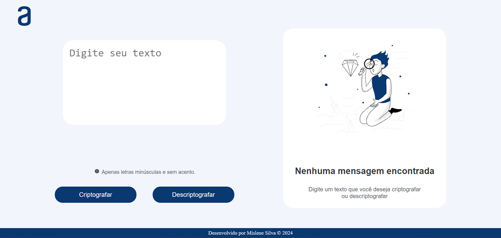
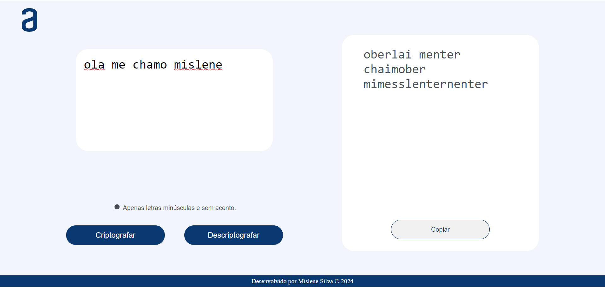
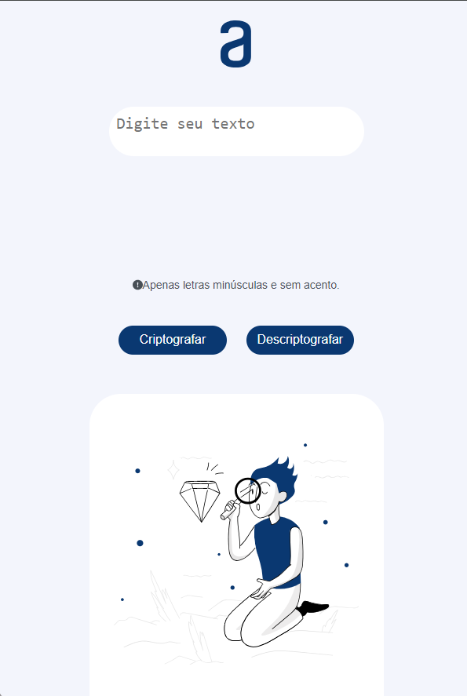

<h1 align="center"> Decodificador de Texto </h1>

Desenvolvido por:
 Mislene Moura - [Linkedin](https://www.linkedin.com/in/mislene-silva-moura-1211531b4//) |
   [Github](https://github.com/MisleneSM)

## Índice

* [1. Resumo do projeto](#1-resumo-do-projeto)
* [2. Objetivos de aprendizagem](#2-objetivos-de-aprendizagem)
* [3. Resultado do Projeto](#3-resultado-do-projeto)
* [4. Tecnologias Utilizadas](#4-tecnologias-utilizadas)

***

## 1. Resumo do Projeto🤩

Desenvolvido um Decodificador de Texto responsivo, tendo como principal objetivo criptografar e descriptografar palavras. Desafio proposto aos alunos pela ONE Oracle Next Education em parceria com a Alura.

Sobre o desafio:
As "chaves" de criptografia que utilizaremos são:

`A letra "e" é convertida para "enter"`

`A letra "i" é convertida para "imes"`

`A letra "a" é convertida para "ai"`

`A letra "o" é convertida para "ober"`

`A letra "u" é convertida para "ufat"`

Requisitos:

- Deve funcionar apenas com letras minúsculas

- Não devem ser utilizados letras com acentos nem caracteres especiais

- Deve ser possível converter uma palavra para a versão criptografada e também retornar uma palavra criptografada para a versão original.

Por exemplo:

`"gato" => "gaitober"`
`gaitober" => "gato"`

- A página deve ter campos para inserção do texto a ser criptografado ou descriptografado, e a pessoa usuária deve poder escolher entre as duas opções

- O resultado deve ser exibido na tela.

<strong>Extras:</strong>

- Um botão que copie o texto criptografado/descriptografado para a área de transferência - ou seja, que tenha a mesma funcionalidade do ctrl+C ou da opção "copiar" do menu dos aplicativos.

Para acessar o resultado do projeto e trocar mensagens secretas com outras pessoas basta clicar aqui no [Link](https://mislenesm.github.io/Decodificador-de-Texto/)
#challengeonedecodificador6

## 2. Objetivos de aprendizagem✅

- HTML
- CSS / Medias Querys
- JavaScript

## 3. Resultado do Projeto📝

##### Desktop

###### Proposta
;

###### Resultado Final

##### Mobile

## 4. Tecnologias Utilizadas✅

     
